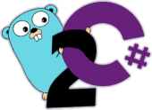

# Golang to C# Converter

Converts source code developed using the Go programming language (see [Go Language Specification](https://golang.org/ref/spec)) to the C# programming language (see [C# Language Specification](https://github.com/dotnet/csharplang/blob/master/spec/README.md)).

## Goals

* Convert Go code into C# so that Go code can be directly used within .NET ecosystem.
  * This is the primary goal of `go2cs`.
* Convert Go code into visually similar C# code -- see [conversion strategies](ConversionStrategies.md).
  * Go is a minimalist language, as such it provides high-level functionality provided by the compiler. Converted C# code will have more visible code than Go used to provide equivalent functionality, however most of this code will be behind the scenes in separate files using partial class functionality.
* Convert Go units test to C# and verify results are the same (TBD).
  * For most unit tests defined in Go, it should be possible to create an equivalent converted C# unit test. In many cases it may also be possible to successfully compare "outputs" of both unit tests as an additional validation test.
* Convert Go code into managed C# code.
  * Conversion always tries to target managed code, this way code is more portable. If there is no possible way for managed code to accomplish a specific task, an option always exists to create a [native interop library](https://docs.microsoft.com/en-us/dotnet/standard/native-interop/pinvoke) that works on multiple platforms, i.e., importing code from a `.dll`/`.so`/`.dylib`. Even so, the philosophy is to always attempt to use managed code, i.e., not to lean towards native code libraries, regardless of possible performance implications. Simple first.

## Project Status

Picking up this project again now that .NET 5.0 is forthcoming and some of the new changes are conducive to this project's original goals, such as [publishing as a self-contained executable](https://docs.microsoft.com/en-us/dotnet/core/deploying/#publish-self-contained).

Converted code now targets .NET Core only, specifically version 3.1 and C# 8.0 with goal to support .NET 5.0 and C# 9.0 when it comes out. Many basic conversion now work. Currently, work to improve code conversions is progressing by walking through each of the [behavioral testing](https://github.com/GridProtectionAlliance/go2cs/tree/master/src/Tests/Behavioral) projects.

As a new conversion strategy to cover various code use cases, sets of common Go sample code have been manually converted to C# using the current [C# Go Library](https://github.com/GridProtectionAlliance/go2cs/blob/master/src/gocore/). As an example, all relevant code samples from the "[Tour of Go](https://tour.golang.org/welcome/1)" have been converted to C#, [see converted code](https://github.com/GridProtectionAlliance/go2cs/blob/master/src/Examples/Manual%20Tour%20of%20Go%20Conversions/). Ultimately would like to see this in head-to-head mode using [Try .NET](https://github.com/dotnet/try), for example:

Currently converted code will not execute with latest release of Try .NET (see [posted issue](https://github.com/dotnet/try/issues/859)). Will be watching for an update.

As releases are made for  updated `go2cs` executables, this will also include updates to pre-converted [Go Standard Library libraries for reference from NuGet](https://www.nuget.org/packages?q=%22package+in+.NET+for+use+with+go2cs%22).

## Testing

Current conversions reference compiled assemblies of the go2cs core library code in the current `GOPATH`, specifically `%GOPATH%\src\go2cs\`. Run the `deploy-gocore.bat` script located in the `go2cs\src` folder to handle copying source then building needed debug and release assemblies.

Once a compiled version of the current go2cs core library has been deployed, you can test conversions. For example:

```Shell
go2cs -o -i D:\Projects\go2cs\src\Tests\Behavioral\ArrayPassByValue
```

This will convert Go code to C#. You can then build and run both the Go and C# versions and compare results.

## Installation

> There's no official release yet, but you can compile the code to produce a `go2cs` executable.

Copy the `go2cs.exe` into the `%GOBIN%` or `%GOPATH%\bin` path. This should compile as a standalone executable for your target platform with no external dependencies, see [publish profiles](https://github.com/GridProtectionAlliance/go2cs/tree/master/src/go2cs/Properties/PublishProfiles).

## Usage

1. Make sure source  application already compiles with Go (e.g., `go build`) before starting conversion. That means any needed dependencies should already be downloaded and available, e.g., with `go get`.

2. Execute `go2cs` specifying the Go source path or specific file name to convert. For example:
 * Convert a single Go file: `go2cs -l Main.go`
 * Convert a Go project: `go2cs MyProject`
 * Convert Go Standard Library: `go2cs -s -r C:\\Go\src\\`

### Command Line Options

| Option | Description |
|:------:|:------------|
| -l | (Default: false) Set to only convert local files in source path. Default is to recursively convert all encountered "import" packages. |
| -o | (Default: false) Set to overwrite, i.e., reconvert, any existing local converted files. |
| -i | (Default: false) Set to overwrite, i.e., reconvert, any existing files from imported packages. |     
| -t | (Default: false) Set to show syntax tree of parsed source file. |
| -e | (Default: $.^) Regular expression to exclude certain files from conversion, e.g., "^.+\_test\\.go$". Defaults to exclude none. |
| -s | (Default: false) Set to convert needed packages from Go standard library files found in "%GOROOT%\\src". |
| -r | (Default: false) Set to recursively convert source files in subdirectories when a Go source path is specified. |
| -m | (Default: false) Set to force update of pre-scan metadata. |
| -g | (Default: %GOPATH%\\src\\go2cs) Target path for converted Go standard library source files. |
| &#8209;&#8209;help | Display this help screen. |
| &#8209;&#8209;version | Display version information. |   
| value 0 | Required. Go source path or file name to convert. |
| value 1 | Target path for converted files. If not specified, all files (except for Go standard library files) will be converted to source path. |

### Future Options

A new command line option to prefer explicit types over `var` would be handy, e.g., specifying `-x` would request explicit type definitions; otherwise, without applying setting, conversion would default to using `var` where possible.

If converted code ever gets manually updated, e.g., where a new `import` is added, a command line option that would "rescan" the imports in a project and augment the project file to make sure all the needed imports are referenced could be handy.

## C# to Go?

If you were looking to "go" in the other direction, a full _code based_ conversion from C# to Go is currently not an option. Even for the most simple projects, automating the conversion would end up being a herculean task with so many restrictions that it would likely not be worth the effort. However, for using compiled .NET code from within your Go applications you have options:

1. For newer [.NET Core](https://docs.microsoft.com/en-us/dotnet/core/) applications, I would suggest trying the following project from Matias Insaurralde: https://github.com/matiasinsaurralde/go-dotnet -- this codes uses the [CLR Hosting API](https://blogs.msdn.microsoft.com/msdnforum/2010/07/09/use-clr4-hosting-api-to-invoke-net-assembly-from-native-c/) which allows you to directly use .NET based functions from within your Go applications.

2. For traditional .NET applications, a similar option would be to use [cgo](https://golang.org/cmd/cgo/) to fully self-host [Mono](https://www.mono-project.com/) in your Go application, see: http://www.mono-project.com/docs/advanced/embedding/.

## Background

For more background information, see [here](Background.md).
